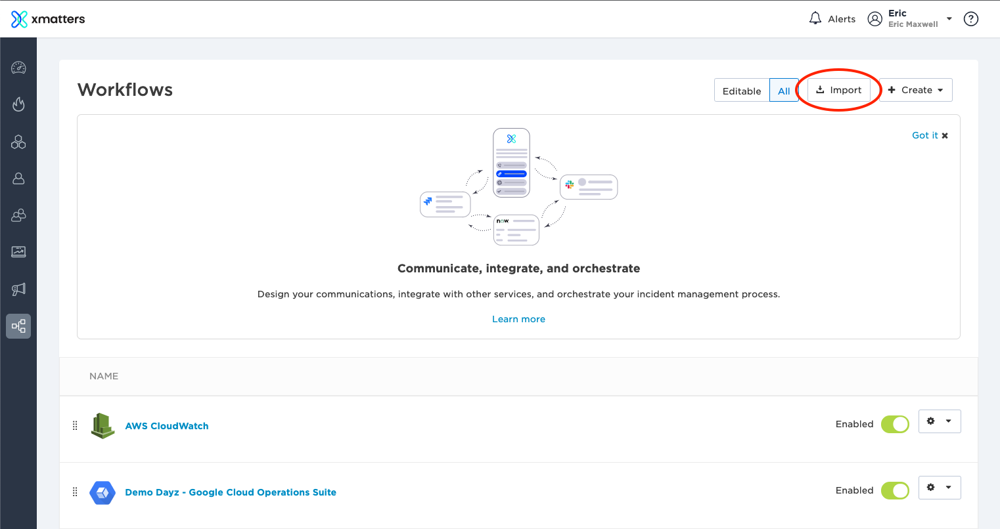
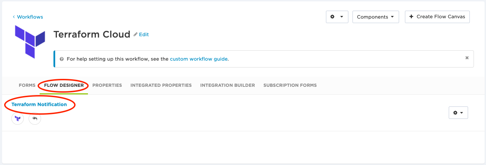
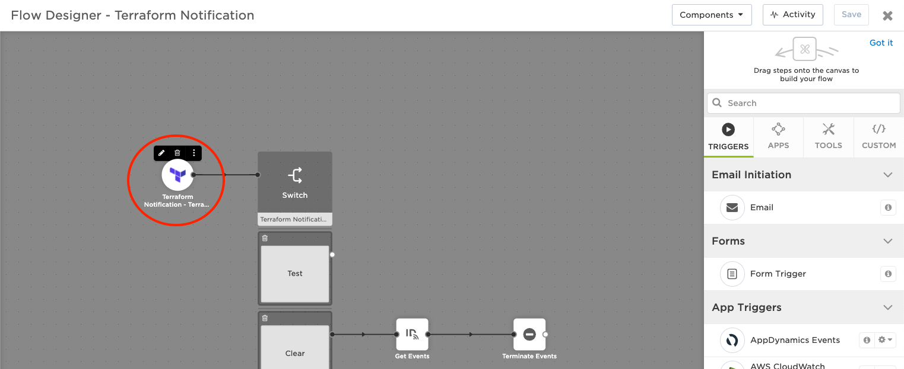
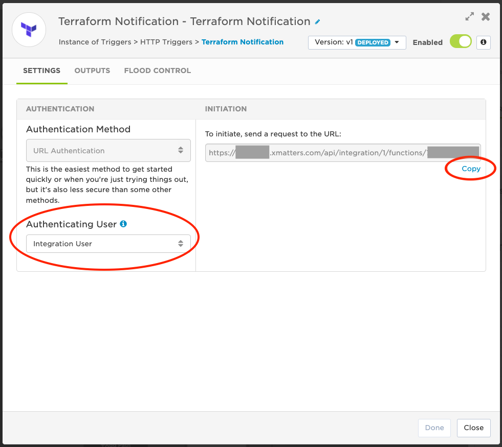
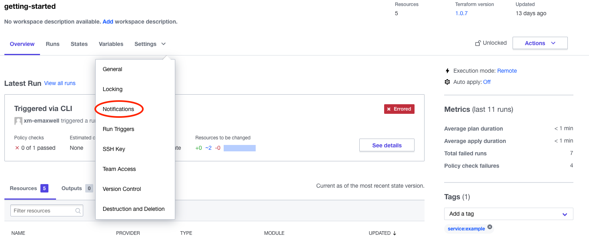
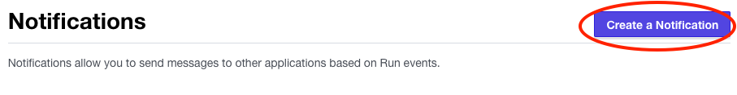
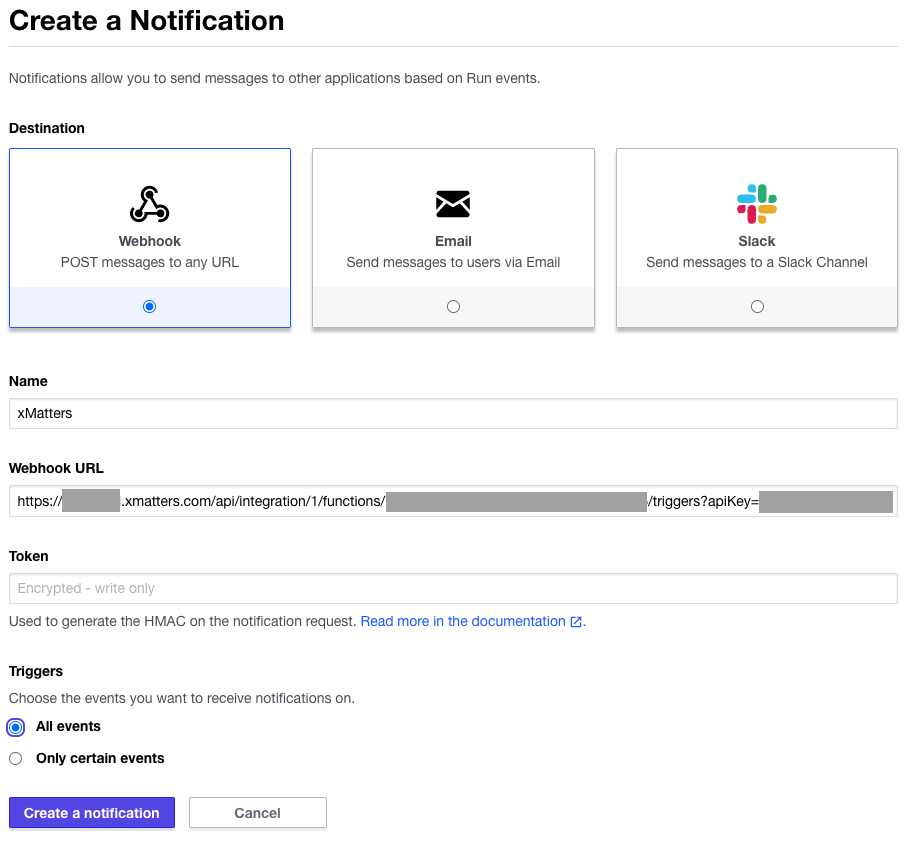
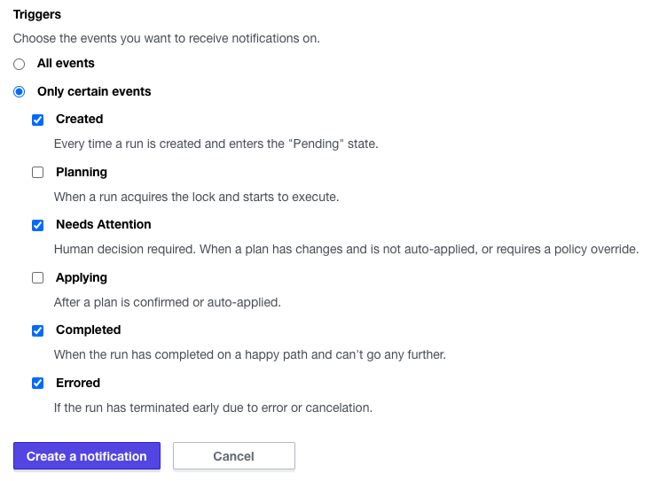

# Terraform Cloud
This is a one-way integration with Terraform Cloud. It allows for xMatters to take in run notifications from Terraform Cloud 

### :scroll: DISCLAIMER
<kbd>
  
</kbd>

---
## Pre-Requisites
* Terrform Cloud
    * Terraform Cloud account
    * Permission to setup notifications in workspace
* xMatters
    * Account - if you don't have one [get one](https://www.xmatters.com) for free
    * Permissions to create/edit Workflows

---
## Files
* xMatters
    * [TerraformCloud.zip](xMatters/workflows/TerraformCloud.zip) - sample workflow
    * [terraformNotification.js](xMatters/src/triggers/terraformNotification.js) - source code for trigger to recieve run notifications

---
## How It Works
When a Terraform run notification is generated it is sent to xMatters to excute automation and send notifications using the xMatters platform.

## Installation
### xMatters - Install and Setup Workflow
#### :blue_book: NOTE
> If you do not already have an xMatters user specifically for integrations it is recommended to create one. This account should only be used for integrations and not need web login permissions. 

1. Clone this repo or download the workflow file [TerraformCloud.zip](xMatters/workflows/TerraformCloud.zip)

2. Login to xMatters and go to Workflows and select **Import** and either browse for or drag the workflow file into the window.

    <kbd>
        
    </kbd>

3. Open the workflow and the go to the **Flow Designer** tab and open the **Terraform Notification** flow

    <kbd>
        
    </kbd>

4. Open the Terraform Notification trigger configuration by double clicking or selecting the pencil in the context menu

    <kbd>
        
    </kbd>

5. On the Settings tab select the user you want Terraform to use to authenticate with.  Then select copy to get the trigger URL.
    #### :blue_book: NOTE
    > The account you are logged in as must be a supervisor of the user for it to show in the list.

    > :pencil2: *Make sure to save in your notes for later when you configure Terraform Cloud.*

    <kbd>
        
    </kbd>

### Terraform Cloud - Setup Notifications

1. Login into Terraform Cloud and go to your workspace. Open the settings menu and select **Notifications** 

    <kbd>
        
    </kbd>

2. Click the **Create a Notification** button to add a new notification configuration.

    <kbd>
        
    </kbd>

3. Select **Webhook**, give the notification a name like "xMatters", and then paste in the xMatter trigger URL you copied earlier.

    <kbd>
        
    </kbd>

4. You can leave Triggers set to "All events", but for the sample workflow all you need are "Created", "Needs Attention", "Completed", "Errored".
    #### :blue_book: NOTE
    > If you want to utilize the other trigger states in your process then you will need to modify the sample flow.

    <kbd>
        
    </kbd>

---
## Testing
1. Start a Terraform run in the workspace you setup xMatters notifications
2. To get notifications you will need to either
    - Start a run with a configuration error
    - Start a run with a policy violation
    - Start a that as an approval step

---
## Troubleshooting
### xMatters Workflow Not Triggering
* Check in xMatters
    * Workflow Configuration
        * Make sure the workflow is enabled
    * Check for Flow Errors
        * Open the Activity monitor in the xMatters flow and look for any errors
* Check in Terraform Cloud
    * Notification Configuration
        * Verify you are using the correct xMatters trigger URL and that you entered the entire URL
        * If you are not triggering on all events verify you have the correct ones enabled
